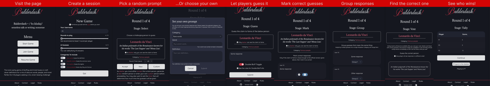

# Overview

This is an unofficial web app for the popular online multiplayer game, Balderdash. The first iteration of this app can be found [in this repo](https://github.com/ivan-rivera/balderdash-next/tree/main) and this version attempts to improve upon the original by adding more features and improving the overall user experience. What's new?

- Extra categories, not just rare words
- Support for custom definitions
- Ability to double bluff
- Ability to introduce AI/NPC guesses to make the game more interesting
- Ability to invite players into the session
- Optional timer that forces players to respond quickly
- Ability to kick unresponsive players
- Ability to resume game after a player disconnects
- Feedback collection mechanisms allowing players to share their opinions on the game
- Bug fixes and better handling of edge cases
- Dark mode, improved UI and better desktop support
- Hopefully cleaner codebase, improved database security and better performance

Here is a screenshot of the app flow:

# Gameplay

- You need at least 3 people to play
- One person sets up the game, the others join
- The game is played in rounds where one person will be the "dasher" and the others will be "guessers"
- The dasher selects a challenging prompt (e.g. rare word) and the guessers first try to either guess it or come up with a convincing fake response (e.g. word definition)
- The dasher marks submitted guesses and points are awarded to the correct submissions
- The rest of the guesses are submitted into a shared pool and the guessers then need to vote for the correct response
- Points are awarded based on the number of votes received (see the Rules tab for more info about scoring)

# For Developers

This app is built using SvelteKit and Firebase. All contributions are wholeheartedly welcome. Here is how you can help:

- Submit an issue
- Submit a pull request with an improvement (I suggest you start with an issue first to discuss the change)
- Add a new word category into this repository (To be added later)
- Play the game and provide feedback

If you need to run this app locally, then first run `bun install` (I used bun but you can use NPM or whenever you prefer), then `bun dev` will start the server. To run tests use `bun test:lib`. Note that you will need to set up a Firebase project (and most likely a PostHog project but don't worry -- both are entirely free) and add the necessary environment variables (inside .env) to run the app. To see the environment variables you'll need checkout `.github/workflows/ci.yaml` and `src/lib/firebase/server.js`.

If you would like to work on this project but you are struggling to get started, please feel free to reach out and I would be happy to help! :)
